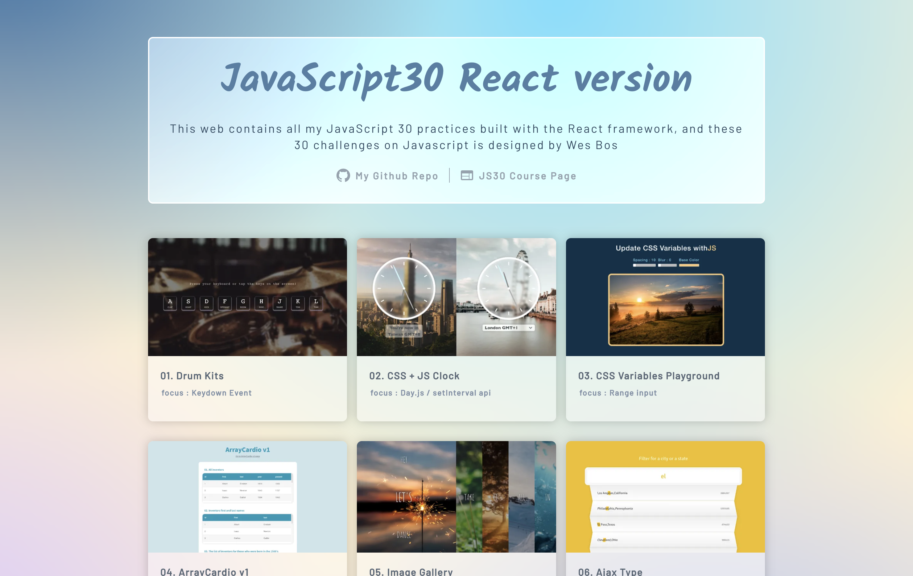

# JavaScript 30 Challenges with React

### This web contains all my JavaScript 30 practices built with the React framework, and these 30 challenges on Javascript is designed by Wes Bos.

> You can see the course here : https://javascript30.com/

> My JS30 website : https://elynnachuang.github.io/js30/



---

## 準備 (Prerequisites)

運行此專案前，最好先確定 Node.js 的版本為 18.16.0 或是更新

You're going to need : Node.js v18.16.0 or newer

---

## 啟動專案 (Start Project)

1. 開啟終端機，將此專案複製至本機電腦

   Open your terminal and clone this project to your computer.

   ```
   git clone https://github.com/ElynnaChuang/js30.git
   ```

2. 進入專案資料夾

   Go into js30 folder

   ```
   cd js30
   ```

3. 安裝套件

   Install all packages

   ```
    npm install // or run 'npm i'
   ```

4. 啟動程式

   Start this project

   ```
   npm run start
   ```

5. 專案成功在 http://localhost:3000/js30 啟動

   You can now see the web is running at http://localhost:3000/js30

6. 結束程式

   End the web

   ```
   ctrl + c
   ```

---

### 任務清單 (Challenges List)

- [x] Day 1 - JavaScript Drum Kit
- [x] Day 2 - CSS + JS Clock
- [x] Day 3 - Playing with CSS Variables and JS
- [x] Day 4 - Array Cardio Day 1
- [x] Day 5 - Flex Panels Image Gallery
- [x] Day 6 - Ajax Type Ahead
- [x] Day 7 - Array Cardio Day 2
- [x] Day 8 - Fun with HTML5 Canvas
- [x] Day 9 - 14 Must Know Dev Tools Tricks
- [x] Day 10 - Hold Shift to Check Multiple Checkboxes
- [x] Day 11 - Custom HTML5 Video Player
- [x] Day 12 - Key Sequence Detection (KONAMI CODE)
- [x] Day 13 - Slide In on Scroll
- [x] Day 14 - Object and Arrays - Reference VS Copy
- [x] Day 15 - LocalStorage and Event Delegation
- [x] Day 16 - CSS Text Shadow Mouse Move Effect
- [x] Day 17 - Sorting Band Names without articles
- [x] Day 18 - Tally String Times with Reduce
- [x] Day 19 - Unreal Webcam Fun
- [x] Day 20 - Native Speech Recognition
- [x] Day 21 - Geolocation based Speedometer and Compass
- [x] Day 22 - Follow Along Links
- [x] Day 23 - Speech Synthesis
- [ ] Day 24 - Sticky Nav
- [ ] Day 25 - Event Capture, Propagation, Bubbling and Once
- [ ] Day 26 - Stripe Follow Along Dropdown
- [ ] Day 27 - Click and Drag to Scroll
- [ ] Day 28 - Video Speed Controller UI
- [ ] Day 29 - Countdown Clock
- [ ] Day 30 - Whack A Mole Game
